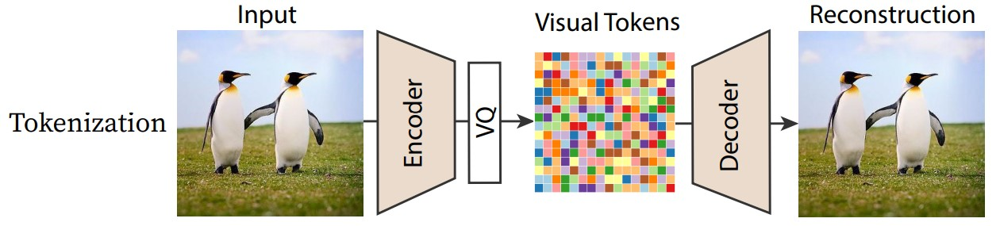
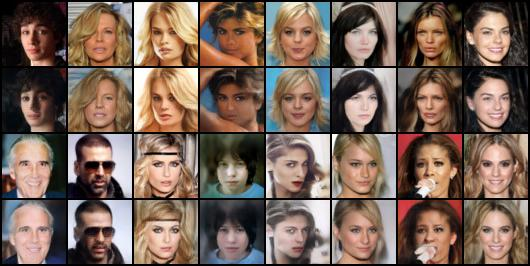
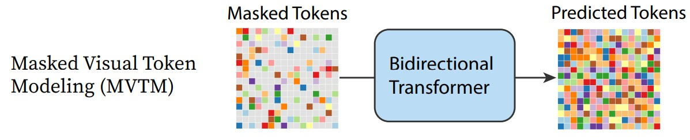
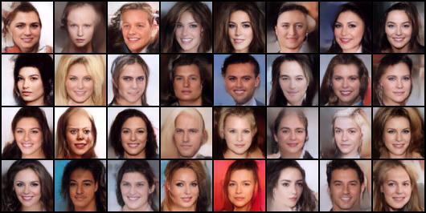

# Minimal-MaskGIT
Implementation of MaskGIT generative model with minimal dependencies, designed to be easily tested on low-cost hardware and plug-and-play with other projects.

## Dependancy
Dpendencies of the models:
- pytorch = 2.0.1
- torchvision = 0.15.2

## Dataset 
Download the [Celeba-HQ dataset](https://www.kaggle.com/datasets/badasstechie/celebahq-resized-256x256) and place the unzip data under `datasets/`.
The dataset folder will looks like:
```
├ Minimal-MaskGIT/
|   ├── datasets/
|   |   ├── celeba_hq/
|   |       ├── celeba_hq_256/  
|   |           ├── 00000.jpg   
|   |           ├── 00001.jpg      
|   |           └── ...
```

## Models
### Step 1: Vector Quantization Modeling


```
python train_vq.py
```

Image reconstruction results of VQVAE (100 epoch)



### Step 2: MVTM (Masked Visual Token Modeling)


```
python train_maskgit.py
```

Image generation results of MVTM (100 epoch)



## References
- https://github.com/dome272/VQGAN-pytorch
- https://github.com/dome272/MaskGIT-pytorch